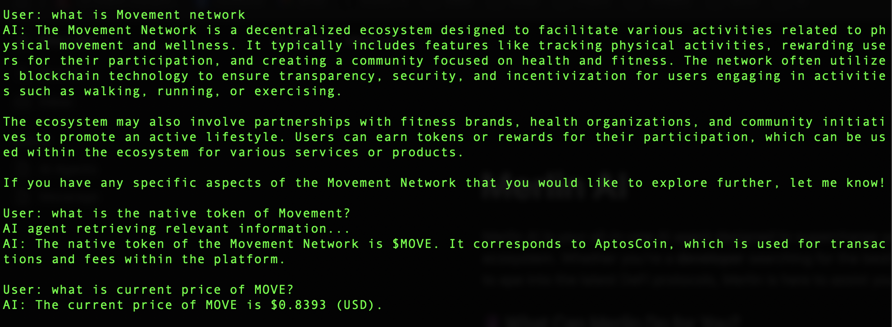
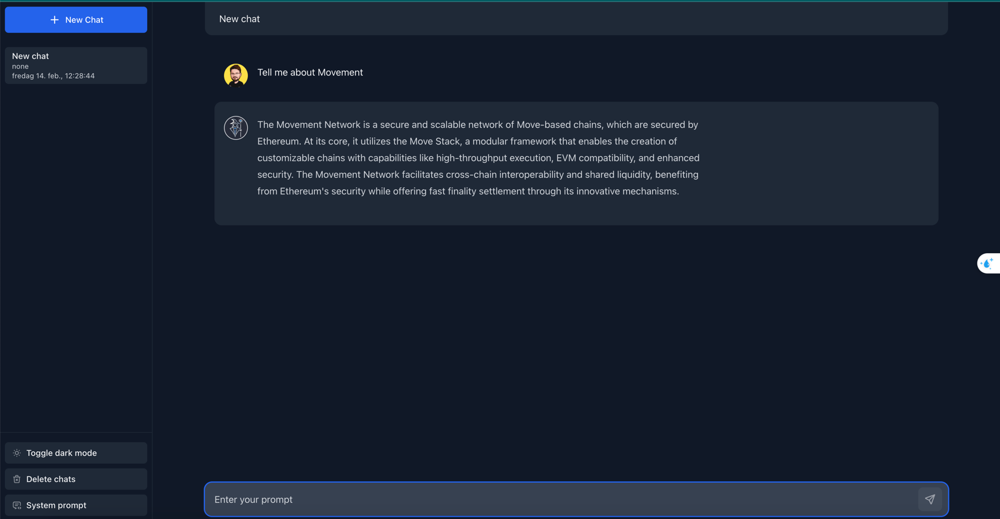

# merlin-ai
Merlin AI is your all-in-one AI agent designed to supercharge your journey through the Movement ecosystem. Whether you're a developer searching for the best Move modules or a degen ready to ape into the latest DeFi protocols, Merlin is here to assist you every step of the way.

### 🔮 What Can Merlin Do for You?

- **Answer Anything About Movement:** Get instant insights into the Movement network, ecosystem, and its evolving landscape.
- **Seamless Swaps & Liquidity:** Effortlessly trade assets via Mosaic API or interact with top DeFi platforms—lend, borrow, provide liquidity, and more.
- **Stay in the Loop:** Receive real-time updates, breaking news, and the hottest trends in Movement and beyond.

With Merlin AI, navigating the Movement ecosystem has never been easier. Whether you're coding, trading, or just exploring—Merlin’s got your back. 🚀

### Terminal version

### Web version
[Clik here](https://merlin-ai-interface.vercel.app/)

