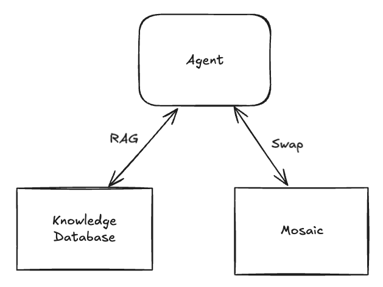
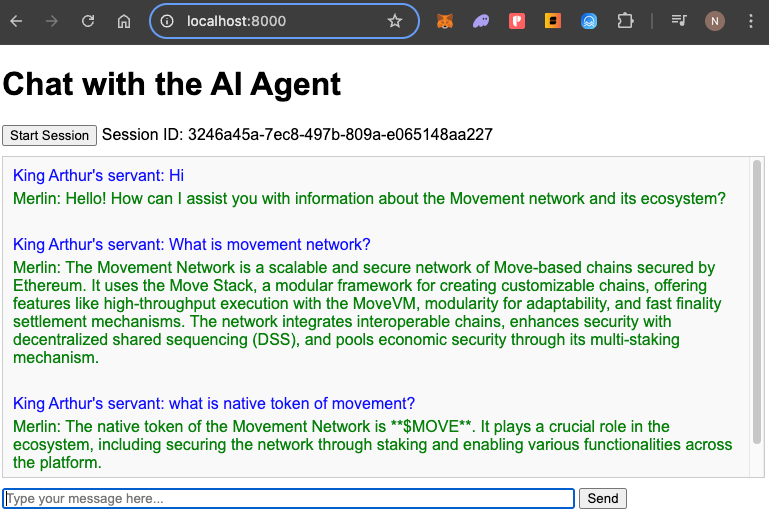

# AI Agent for the Movement Ecosystem


An AI-driven chatbot that answers questions about the Movement network and its ecosystem.  
- **LangChain** for building the agent and chaining LLM interactions.  
- **OpenAI** for embeddings and LLM calls.  
- **Chroma** as a local vector store for Retrieval-Augmented Generation (RAG).  

---

## 1. Prerequisites & Environment

- **Python 3.8+** recommended.  
- Set your OpenAI key in the environment variable `OPENAI_API_KEY`. (required).

---

## 2. Install Dependencies

To install all necessary libraries:

```bash
pip install -r requirements.txt
```

---

## 3. Crawl dapps data
- Ensure your GOOGLE_SHEET_API_KEY is set (see https://support.google.com/googleapi/answer/6158862?hl=en for more details).

- Run the craw_data script:

```bash
python crawl_data.py
```

This script will:

- Read list dapps through Google Sheet API.
- Append general information to txt file then crawl docs page if it exists

## 4. Embedding Documents
Before using the chatbot, you must embed the Movement documentation:

- Ensure your OPENAI_API_KEY is set (see above).

- Run the embedding script:

```bash
python embed.py
```

This script will:

- Read your .txt or other source documents.
- Chunk them for better retrieval (e.g., 1000 tokens with some overlap).
- Use an OpenAI embedding model (e.g., text-embedding-3-large) to create vector embeddings of each chunk.
- Store those embeddings in a local Chroma database (the ./db folder by default).

## 5. Run the Chatbot
Once the database is populated with embeddings, you can launch the chatbot:


```bash
python chatbot.py
```

- A command-line interface starts.
- Ask questions about the Movement ecosystem.
- The agent retrieves relevant context from Chroma, then provides an answer.
- Type bye, quit, or exit to end the session.


## 6. Run the api

```bash
python api.py
```

access the api at http://localhost:8000/


